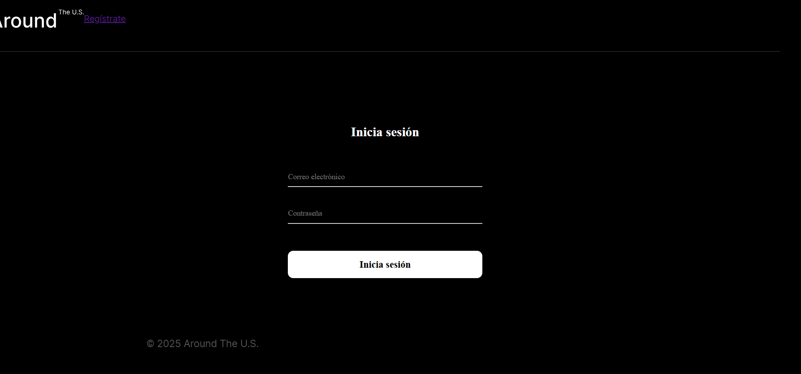
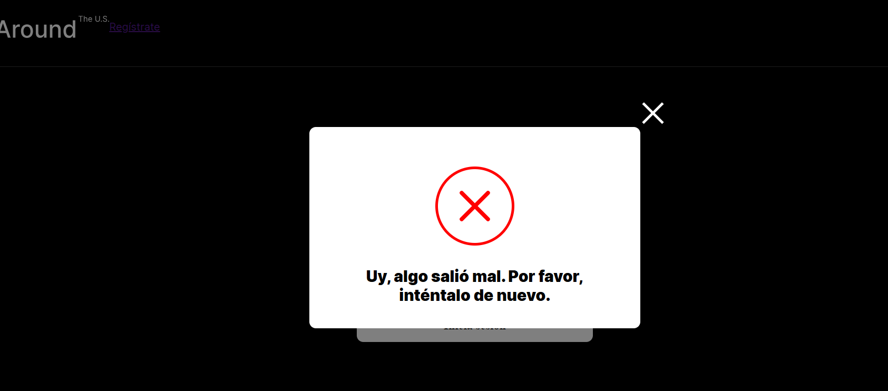
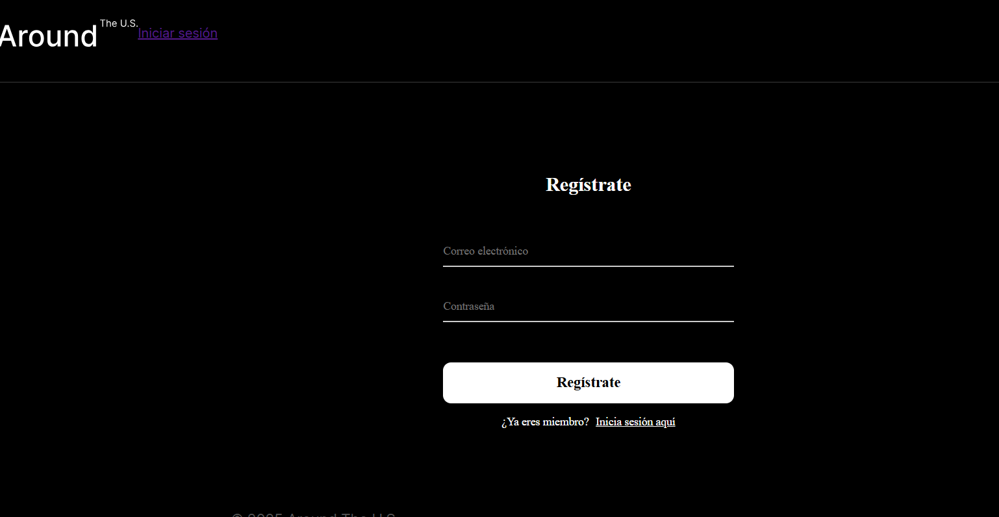

# Tripleten web_project_api_full

## Descripción del proyecto
**Around the U.S.** es una aplicación web interactiva full-stack donde se puede compartir fotografías, darle "me gusta" a publicaciones de otros usuarios y editar su propio perfil. 

Esta versión integra tanto el front-end hecho con React como un servidor back-end desarrollado con Node.js y Express, con persistencia de datos en MongoDB, autenticación de usuarios mediante tokens JWT, cifrado de contraseñas y validación estricta de solicitudes.

---

## Funcionalidades principales
* **Registro y autenticación de usuarios:** Registro con correo y contraseña cifrada (bcryptjs), inicio de sesión con emisión de JWT.
* **Rutas protegidas:** Control de acceso en el cliente y servidor para usuarios autenticados.
* **Gestión de perfil:** Actualización de nombre, ocupación y foto de avatar.
* **Gestión de tarjetas:** Publicación de imágenes con título, eliminación de tarjetas propias y funcionalidad de "me gusta".
* **Manejo centralizado de errores y logs:** Registro automático de solicitudes (`request.log`) y errores (`error.log`) mediante Winston, con respuestas HTTP estandarizadas.

---

## Tecnologías y herramientas utilizadas
* **Front-End:** React.js, React Router, JavaScript (ES6+), CSS3 (Metodología BEM), Vite.
* **Back-End:** Node.js, Express.js, MongoDB, Mongoose.
* **Seguridad y Validación:** JSON Web Tokens (JWT), bcryptjs, Celebrate / Joi, Validator.
* **Despliegue y Servidor:** Nginx, PM2, Certbot (Certificados SSL/HTTPS), Google Cloud Compute Engine, FreeDNS.
* **Calidad de Código y Registros:** ESLint, Winston, express-winston.

---

## Enlace a la aplicación desplegada (URL)
* **Sitio Web (Front-End):** [https://joss.happyminecraft.org](https://joss.happyminecraft.org)
* **API Back-End:** [https://api.joss.happyminecraft.org](https://api.joss.happyminecraft.org)

---

## Capturas de pantalla

